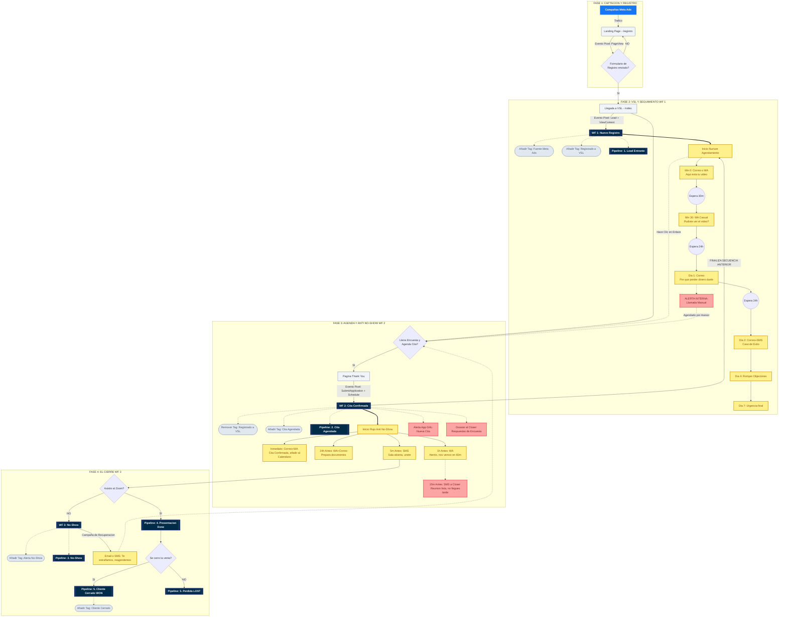

```mermaid
graph TD
    %% ESTILOS %%
    classDef meta fill:#1877F2,color:#ffffff,stroke:#none,font-weight:bold;
    classDef landing fill:#F1F5F9,stroke:#94A3B8,stroke-width:2px;
    classDef action fill:#1AE5ED,color:#002B49,stroke:#0FA5AB,stroke-width:2px,font-weight:bold;
    classDef comms fill:#FEF08A,color:#854D0E,stroke:#CA8A04,stroke-width:2px;
    classDef internal fill:#FCA5A5,color:#7F1D1D,stroke:#EF4444,stroke-width:2px;
    classDef tag fill:#E2E8F0,color:#475569,stroke:#94A3B8,stroke-width:1px;
    classDef pipeline fill:#002B49,color:#ffffff,stroke:#none,font-weight:bold;

    %% FASE 1: CAPTACIÓN %%
    subgraph fase1 [FASE 1: CAPTACION Y REGISTRO]
        A[Campañas Meta Ads]:::meta -->|Trafico| B(Landing Page - /registro):::landing
        B -->|Evento Pixel: PageView| C{Formulario de <br>Registro enviado?}
    end

    %% FASE 2: NURTURE Y VSL %%
    subgraph fase2 [FASE 2: VSL Y SEGUIMIENTO WF 1]
        C -- NO --> B
        C -- SI --> D[Llegada a VSL - /video]:::landing
        
        %% Workflow 1 y Tags %%
        D -->|Evento Pixel: Lead + ViewContent| WF1[[WF 1: Nuevo Registro]]:::pipeline
        WF1 -.-> Tag1([Añadir Tag: Fuente Meta Ads]):::tag
        WF1 -.-> Tag2([Añadir Tag: Registrado a VSL]):::tag
        WF1 -.-> Pipe1[[Pipeline: 1. Lead Entrante]]:::pipeline

        %% Flujo de Nurture - Externa %%
        WF1 ==> Nurture[Inicio Nurture Agendamiento]:::comms
        Nurture --> N0[Min 0: Correo o WA <br> Aqui esta tu video]:::comms
        Nrture_Wait1((Espera 30m))
        N0 --> Nrture_Wait1 --> N30[Min 30: WA Casual <br> Pudiste ver el video?]:::comms
        Nrture_Wait2((Espera 24h))
        N30 --> Nrture_Wait2 --> ND1[Dia 1: Correo <br> Por que perder dinero duele]:::comms
        Nrture_Wait3((Espera 24h))
        ND1 --> Nrture_Wait3 --> ND2[Dia 2: Correo+SMS <br> Caso de Exito]:::comms
        
        %% Tarea Interna %%
        ND1 -.-> Task1[ALERTA INTERNA: <br> Llamada Manual]:::internal
        
        ND2 --> ND4[Dia 4: Romper Objeciones]:::comms --> ND7[Dia 7: Urgencia final]:::comms
    end

    %% FASE 3: AGENDA %%
    subgraph fase3 [FASE 3: AGENDA Y ANTI NO-SHOW WF 2]
        D --> E{Llena Encuesta y<br>Agenda Cita?}
        Nurture -.->|Hace Clic en Enlace| E
        Task1 -.->|Agendado por Asesor| E
        
        E -- SI --> F[Pagina Thank You]:::landing
        F -->|Evento Pixel: SubmitApplication + Schedule| WF2[[WF 2: Cita Confirmada]]:::pipeline
        
        %% Workflow 2 y Tags %%
        WF2 -.-> Tag3([Remover Tag: Registrado a VSL]):::tag
        WF2 -.-> Tag4([Añadir Tag: Cita Agendada]):::tag
        WF2 -.-> Pipe2[[Pipeline: 2. Cita Agendada]]:::pipeline
        
        %% Freno al WF1 %%
        WF2 -->|FINALIZA SECUENCIA ANTERIOR| Nurture

        %% Flujo Anti No-Show %%
        WF2 ==> ShowUp[Inicio Flujo Anti No-Show]:::comms
        ShowUp --> S_Inm[Inmediato: Correo+WA <br> Cita Confirmada, añadir al Calendario]:::comms
        ShowUp --> S_24h[24h Antes: WA+Correo <br> Prepara documentos]:::comms
        ShowUp --> S_1h[1h Antes: WA <br> Atento, nos vemos en 60m]:::comms
        ShowUp --> S_5m[5m Antes: SMS <br> Sala abierta, unete]:::comms
        
        %% Notificaciones Internas %%
        WF2 -.-> Int1[Alerta App GHL: <br> Nueva Cita]:::internal
        WF2 -.-> Int2[Dossier al Closer: <br> Respuestas de Encuesta]:::internal
        S_1h -.-> Int3[15m Antes: SMS a Closer <br> Reunion lista, no llegues tarde]:::internal
    end

    %% FASE 4: VENTA %%
    subgraph fase4 [FASE 4: EL CIERRE WF 3]
        Z{Asistio al Zoom?}
        S_5m --> Z
        
        %% Flujo No-Show %%
        Z -- NO --> WF3[[WF 3: No-Show]]:::pipeline
        WF3 -.-> Tag5([Añadir Tag: Alerta No-Show]):::tag
        WF3 -.-> Pipe3[[Pipeline: 3. No-Show]]:::pipeline
        WF3 -->|Campaña de Recuperacion| Reagendar[Email o SMS: Te extrañamos, reagendemos]:::comms
        Reagendar -.-> E
        
        %% Flujo Presentación y Cierre %%
        Z -- SI --> Pipe4[[Pipeline: 4. Presentacion Done]]:::pipeline
        Pipe4 --> Venta{Se cerro la venta?}
        Venta -- SI --> Pipe5[[Pipeline: 5. Cliente Cerrado WON]]:::pipeline
        Pipe5 -.-> Tag6([Añadir Tag: Cliente Cerrado]):::tag
        Venta -- NO --> PipeL[[Pipeline: 5. Perdida LOST]]:::pipeline
    end
```
