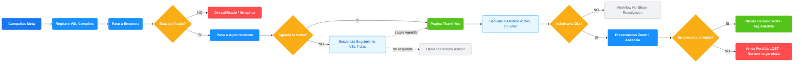

```mermaid
graph LR
    %% ESTILOS
    classDef meta fill:#1877F2,color:#ffffff,stroke:none,font-weight:bold,rx:5px,ry:5px;
    classDef step fill:#1890ff,color:white,stroke:none,font-weight:bold,rx:5px,ry:5px;
    classDef decision fill:#faad14,color:white,stroke:none,font-weight:bold,rx:5px,ry:5px;
    classDef success fill:#52c41a,color:white,stroke:none,font-weight:bold,rx:5px,ry:5px;
    classDef fail fill:#ff4d4f,color:white,stroke:none,font-weight:bold,rx:5px,ry:5px;
    classDef gray fill:#f0f2f5,color:#595959,stroke:#d9d9d9,stroke-width:2px,rx:5px,ry:5px;
    classDef comms fill:#E6F7FF,color:#0050B3,stroke:#69C0FF,stroke-width:2px,rx:5px,ry:5px;

    %% ETAPA 1: REGISTRO Y ENCUESTA
    A[Campañas Meta]:::meta --> B(Registro VSL Completo):::step
    B --> C(Paso a Encuesta):::step

    %% ETAPA 2: CALIFICACIÓN
    C --> Califica{Esta calificado?}:::decision
    Califica -- NO --> Desca[Descalificado / No aplica]:::fail
    Califica -- SI --> D[Paso a Agendamiento]:::step
    
    %% ETAPA 3: LA AGENDA
    D --> Agenda{Agenda la fecha?}:::decision
    Agenda -- SI --> E(Pagina Thank You):::success
    Agenda -- NO --> Nurt[Secuencia Seguimiento VSL 7 dias]:::comms
    Nurt -.->|Logra Agendar| E
    Nurt -.->|No responde| Manual[Llamada Rescate Asesor]:::gray
    
    %% ETAPA 4: SHOW UP (RECORDATORIOS)
    E --> Rem[Secuencia Asistencia: 24h, 1h, 5min]:::comms
    Rem --> G{Asiste a la Cita?}:::decision
    
    %% ETAPA 5: PRESENTACIÓN Y CIERRE (DÍA DE LA REUNIÓN)
    G -- NO --> NoShow[Workflow No-Show: Reactivacion]:::gray
    G -- SI --> Pres(Presentacion Zoom / Asesoria):::step
    
    %% ETAPA 6: ESTADO FINAL DE VENTA
    Pres --> Venta{Se concreta la venta?}:::decision
    Venta -- SI --> Won[Cliente Cerrado WON - Tag Añadido]:::success
    Venta -- NO --> Lost[Venta Perdida LOST - Nurture largo plazo]:::fail
```
