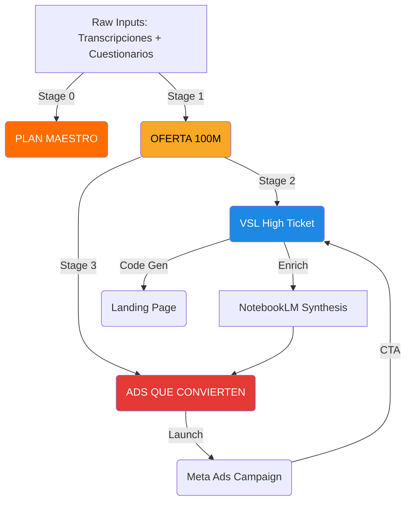

# Managing Notion — Client Operations Hub

This skill is the **gateway** to all client operations. It must be activated FIRST, before any other skill, whenever working with a client.

> [!IMPORTANT]
> ## 🗺️ CANONICAL NOTION ROUTES (PERMANENT)
> These routes are saved in `src/lib/constants.ts`. NEVER hardcode IDs anywhere else.
>
> | Route | Type | ID | URL |
> |---|---|---|---|
> | **Plantillas de Presentación** | Page | `303e0f37-6c6d-80be-9628-e919582f3b46` | [Link](https://www.notion.so/Plantillas-de-Presentaci-n-303e0f376c6d80be9628e919582f3b46) |
> | **Procesos de Clientes** | Page (contains DB) | `2f7e0f37-6c6d-8148-94ce-ca5cc5d53b9d` | [Link](https://www.notion.so/Procesos-de-Clientes-2f7e0f376c6d814894ceca5cc5d53b9d) |
> | **Clientes Database** (actual DB) | Database | `2f7e0f37-6c6d-81b6-9cba-df48640f2afe` | Inside Procesos page |
>
> **Master Templates** (children of Plantillas):
> - `OFERTA 100M`: `303e0f37-6c6d-8096-8dd5-d81be5da6766`
> - `VSL HIGH TICKET`: `303e0f37-6c6d-81db-aa2a-f73cb6acac1f`
> - `ADS QUE CONVIERTEN`: `304e0f37-6c6d-804c-a1e3-d60cc434e278`
> - `PLAN MAESTRO`: `313e0f37-6c6d-801c-aa64-e59ff3a534e8`
>
> **In code**: `import { PLANTILLAS_PAGE_ID, CLIENTES_DATABASE_ID, CLIENTES_PAGE_ID } from '../lib/constants';`

> [!CAUTION]
> ## ⚠️ API vs Manual Access
> The Clientes Database (`2f7e0f37-6c6d-81b6-9cba-df48640f2afe`) may NOT be shared with the API bot.
> If `findClientPageId()` fails, use the known client page ID directly (e.g., Christian Funes = `2fbe0f37-6c6d-80c6-9fe3-da074b223f9d`).
> Known Client IDs should be stored in constants or passed directly.

---

## 1. The "Client Context First" Protocol

Before generating ANY asset, you must **contextualize**. This is mandatory.

### Step 1: Locate the Client Page
- Search for the client in **Procesos de Clientes**
- Use `findClientPageId('Client Name')` or known page ID
- **Goal**: Get the `page_id`

### Step 2: Read Existing Deliverables (Source of Truth)
- **CRITICAL**: Do NOT rely on raw meeting transcripts. The "Truth" is in the **approved deliverables**.
- List child pages of the client page to find:

| Page to Find | Contains | Used By |
|---|---|---|
| **PLAN MAESTRO - [Client]** | Context, objectives, strategy, tasks, pipeline roadmap | All Stages (overview) |
| **OFERTA 100M - [Client]** | Core offer, pricing, promise, mechanisms | Stage 2 (VSL) |
| **VSL High Ticket - [Client]** | Script, arguments, claims, terminology, duration | Stage 3 (Ads) |
| **ADS QUE CONVIERTEN - [Client]** | Ad strategy, angles, copy, CTA | Meta Ads campaigns |

### Step 3: Meetings (Secondary Context Only)
- Only if deliverables are empty or insufficient, search for "Reuniones" linked to the client.

### Step 4: NotebookLM (The Brain)
- Once you have the Offer/VSL content, query **NotebookLM** for deep synthesis.
- Use between Stage 2 and 3 to enrich ad strategy with market insights.

### Step 5: Execute & Save
- Follow the specific Skill Template for the asset type
- Save as a **Child Page** of the client's page in Procesos de Clientes

---

## 2. The 3-Stage Client Pipeline (Mandatory)

For every new client, follow this strict 3-stage process. **Each stage depends on the previous.**

### Stage 0: The Roadmap → PLAN MAESTRO
- **Workflow**: `/create-master-plan`
- **Input**: Knowledge Base + existing deliverables + onboarding transcripts
- **Output**: **"PLAN MAESTRO - [Client]"** page in Notion
- **Contains**: Context, objectives, step-by-step pipeline, strategy, client tasks
- **Rule**: This is the FIRST deliverable created. It's the strategic overview presented to the client.

### Stage 1: The Foundation → OFERTA 100M
- **Skill**: `creating-100m-offers`
- **Input**: Raw transcripts, questionnaires, meetings
- **Output**: **"OFERTA 100M - [Client]"** page in Notion
- **Contains**: Grand Slam Offer, pricing, guarantee, mechanisms, avatar
- **Rule**: This is the SINGLE SOURCE OF TRUTH for all subsequent stages

### Stage 2: The Video → VSL High Ticket
- **Skill**: `creating-vsl`
- **Input**: **ONLY** the OFERTA 100M page from Stage 1
- **Output**: **"VSL High Ticket - [Client]"** page in Notion
- **Contains**: Complete video script, landing page copy, duration (~14 min)
- **Rule**: Strictly derived from Stage 1. No creative deviations.

### Stage 3: The Traffic → ADS QUE CONVIERTEN
- **Skill**: `creating-ads`
- **Input**: OFERTA 100M + VSL High Ticket + NotebookLM insights
- **Output**: **"ADS QUE CONVIERTEN - [Client]"** page in Notion
- **Contains**: Strategy, budget, 3 angles, copy options, ramp-up plan
- **Rules** (Critical learnings):
  - **Hooks must be DIRECT**: Name the avatar in the first 3 seconds
  - **No jargon**: Simple 3-step system, no fancy protocol names  
  - **No video directing**: Clients film themselves, just write the script
  - **CTA → VSL**: Every ad drives to the VSL video, NOT to a call or form
  - **Algorithm-friendly**: Use semantic keywords ("comprar casa", "hipoteca") for Meta targeting
  - **Broad avatar**: Target category buyers (e.g., "personas comprando casa"), not niches

### Pipeline Diagram


**CTA Flow**: Ad → VSL Video → Landing Page Form → Qualified Call

---

## 3. Technical Patterns

### A. Finding Clients
```typescript
import { findClientPageId, listClients, CLIENTES_DATABASE_ID } from '../lib/constants';

// Find a specific client (may fail if DB not shared with API bot)
const clientId = await findClientPageId('Christian Funes');

// Fallback: Use known page ID directly
const christianId = '2fbe0f37-6c6d-80c6-9fe3-da074b223f9d';
```

### B. Reading Client Deliverables
```typescript
import { notion } from '../lib/notion';

const children = await notion.blocks.children.list({ block_id: clientId });
const offerPage = children.results.find(b =>
  (b as any).child_page?.title.includes('OFERTA')
);
const vslPage = children.results.find(b =>
  (b as any).child_page?.title.includes('VSL')
);
```

### C. Creating a Client Asset
```typescript
// Always create as child page of the client
const response = await notion.pages.create({
    parent: { page_id: clientPageId },
    icon: { emoji: '📢' as any },
    properties: {
        title: { title: [{ text: { content: 'ADS QUE CONVIERTEN - [Client]' } }] },
    },
    children: blocks as any,
});
```

### D. Standard Format
- **H1** for section titles
- **Callouts** (💡) for key summaries  
- **Numbered lists** for steps
- **Bold** for key terms
