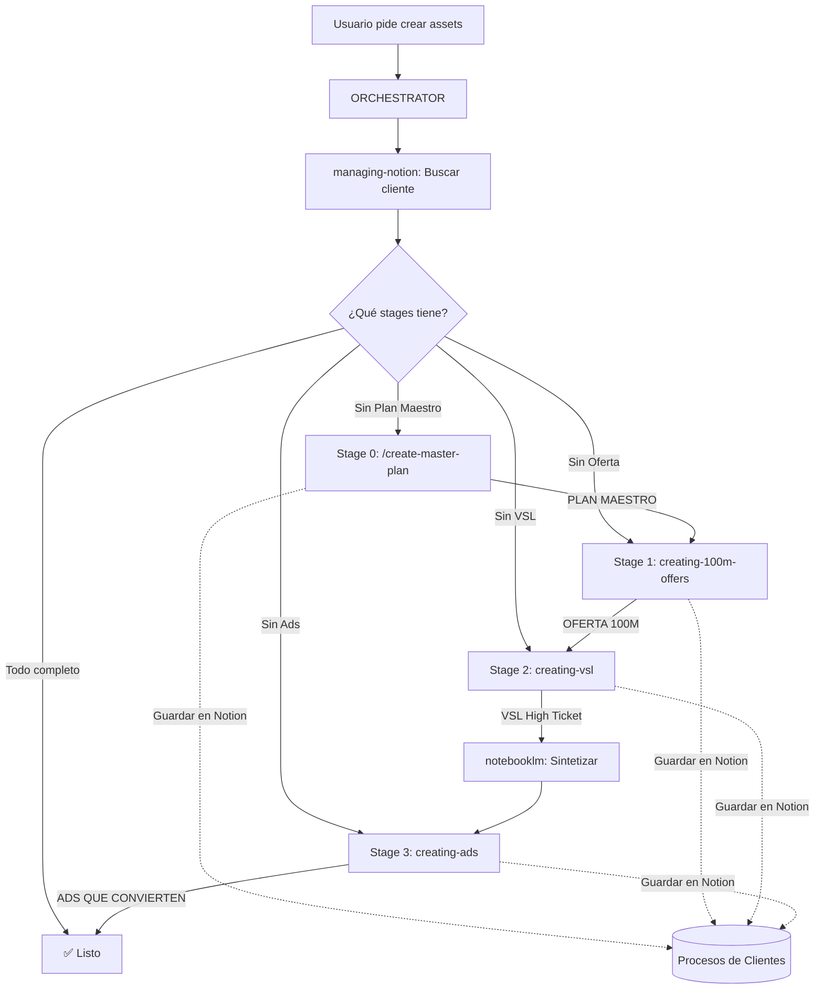

# Orchestrator — Sales Velocity Agent Router

Este skill es el **cerebro de coordinación**. Su trabajo es entender qué necesita el usuario y asignar la(s) skill(s) correcta(s) en el orden correcto.

## When to use this skill
- El usuario pide crear assets para un cliente (oferta, VSL, ads)
- El usuario pide "lanzar" o "procesar" un cliente nuevo
- Se necesita coordinar múltiples skills en secuencia
- El usuario pregunta "¿qué falta?" o "¿cuál es el siguiente paso?"

---

## 🗺️ Mapa de Skills Disponibles

### Skills Operativos (Cliente)

| Skill | Trigger | Input | Output |
|-------|---------|-------|--------|
| `managing-notion` | Buscar cliente, leer contexto, guardar entregables | Nombre del cliente | Page IDs, contexto del cliente |
| `/create-master-plan` | "Plan Maestro", "roadmap", "hoja de ruta", "plan del cliente" | Knowledge Base + entregables existentes | Página PLAN MAESTRO en Notion |
| `creating-100m-offers` | "Crear oferta", "Offer 100M", "Hormozi" | Transcripciones, cuestionarios | Página OFERTA 100M en Notion |
| `creating-vsl` | "VSL", "video sales letter", "guión de video" | OFERTA 100M (Stage 1) | Página VSL High Ticket en Notion |
| `creating-ads` | "Ads", "anuncios", "Meta Ads", "campaña" | OFERTA 100M + VSL | Página ADS QUE CONVIERTEN en Notion |
| `brand-identity` | "Marca", "branding", "identidad visual" | N/A | Guidelines de marca |
| `notebooklm` | "Notebook", "investigar", "sintetizar" | Sources del cliente | Insights, síntesis |

### Skills de Desarrollo

| Skill | Trigger |
|-------|---------|
| `creating-skills` | "Crear un skill", "nueva habilidad" |
| `superpowers` | "Brainstorming", "TDD", "subagents" |
| `error-handling-patterns` | Error handling, resilience |
| `notion-automation` | API patterns, batch operations |

---

## 📋 Protocolo de Routing

Cuando recibes una tarea, sigue este proceso:

### Paso 1: Identificar el Contexto
```
¿Es sobre un CLIENTE específico?
  → SÍ → Ir a Paso 2
  → NO → ¿Es sobre desarrollo/skills? → Activar skill técnico correspondiente
```

### Paso 2: Activar `managing-notion` PRIMERO
- Buscar el cliente en Procesos de Clientes
- Leer sus entregables existentes (¿Ya tiene Oferta? ¿VSL? ¿Ads?)
- Determinar en qué STAGE está

### Paso 3: Determinar el Stage Actual
```
¿Tiene PLAN MAESTRO?
  → NO → Stage 0: Activar `/create-master-plan`
  → SÍ → ¿Tiene OFERTA 100M?
    → NO → Stage 1: Activar `creating-100m-offers`
    → SÍ → ¿Tiene VSL High Ticket?
      → NO → Stage 2: Activar `creating-vsl`
      → SÍ → ¿Tiene ADS QUE CONVIERTEN?
        → NO → Stage 3: Activar `creating-ads`
        → SÍ → ✅ Cliente completo. Preguntar al usuario qué sigue.
```

### Paso 4: Ejecutar el Skill Asignado
- Activar el skill correspondiente al stage
- Pasar el contexto necesario (page IDs, contenido de stages anteriores)
- Guardar el output como child page del cliente en Notion

---

## 🔄 El Pipeline Completo (3 Stages)

Este es el flujo obligatorio para CADA cliente nuevo:



### Reglas del Pipeline
1. **NUNCA saltar stages**. No puedes crear Ads sin VSL. No puedes crear VSL sin Offer.
2. **SIEMPRE verificar** qué stages existen antes de empezar.
3. **NotebookLM** se usa como "cerebro" entre Stage 2 y 3 para sintetizar insights.
4. **Cada output** se guarda como child page del cliente en Notion.

---

## 🚨 Reglas de Interacción con Skills

### Orden de Dependencia
```
managing-notion → SIEMPRE primero (contexto)
/create-master-plan → El PRIMER entregable (Stage 0, roadmap)
creating-100m-offers → Solo con inputs raw (transcripciones)
creating-vsl → Solo con OFERTA 100M existente
creating-ads → Solo con OFERTA 100M + VSL existentes
notebooklm → Entre Stage 2 y 3 para enriquecer
brand-identity → Cuando se necesite identidad visual
```

### Comunicación entre Skills
- El output de un skill es el input del siguiente
- Los Page IDs se pasan como contexto entre stages
- `managing-notion` proporciona los IDs canónicos (ver `src/lib/constants.ts`)

### Errores Comunes a Evitar
- ❌ Crear Ads sin leer la OFERTA 100M primero
- ❌ Usar transcripciones raw cuando ya existe una Oferta aprobada
- ❌ Hardcodear IDs de Notion (usar `constants.ts`)
- ❌ Saltar el paso de NotebookLM antes de crear Ads
